# Robotics Coding Tutorial
In this repo, you will learn the basics of ROS2 and robotics fundamentals. The goal of this tutorial is start with the basics and slowly progress to creating your own full autonomy stack for the stinger tugs. Throughout this tutorial, you will fill out code blocks, answer questions, and write code. After completing each section, there will be a provided autograder that will verify your work. Only by passing all the required autograder tests should you move onto the next section. If you are having a hard time passing some tests, please reach out! We are more than happy to help.

## Prerequisites
- **Some base knowledge of coding/python** If you are not yet familiar with python, you can still attempt to go through this tutorial but it is highly recommended that you learn python first. Some great tutorials are:
  - https://www.w3schools.com/python/
  - https://docs.python.org/3/tutorial/index.html
- Access to your MRG Cluster Virtual Machine
- Basics of Navigating Linux

## Repo Setup

For this tutorial, you will need to fork two repositories [ROS_Tutorial](https://github.com/gt-marine-robotics-group/ROS_Tutorial) and [stinger-software](https://github.com/gt-marine-robotics-group/stinger-software). We will show how to fork the `stinger-software` repo which will be the same steps for the `ROS_Tutorial` repo. First go to the repo.

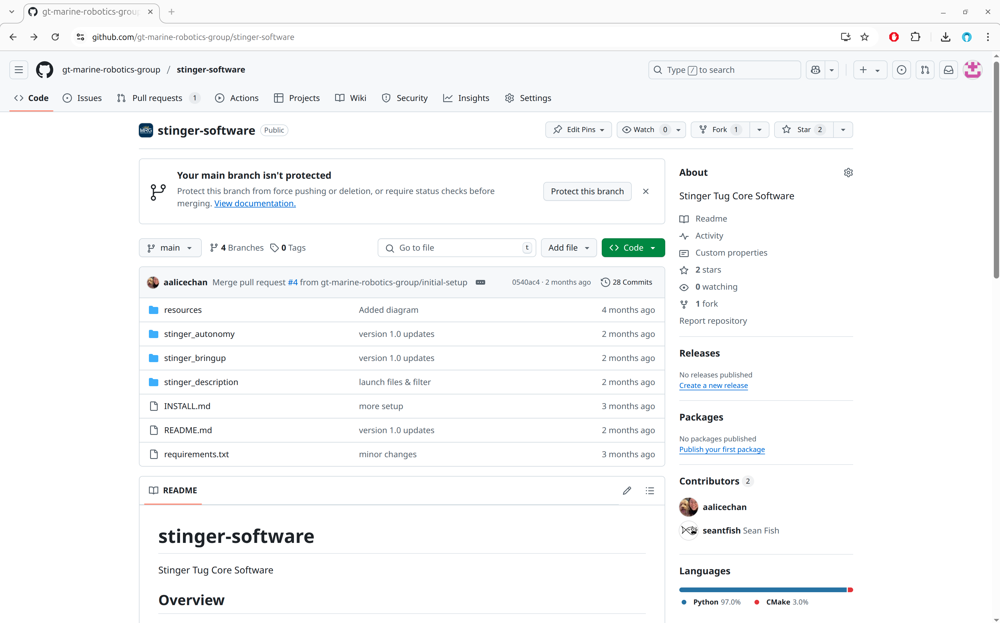

Then click fork.


If prompted, name the repository `stinger-software` (or whatever the original repository was called). Make sure the select owner is under your github username.

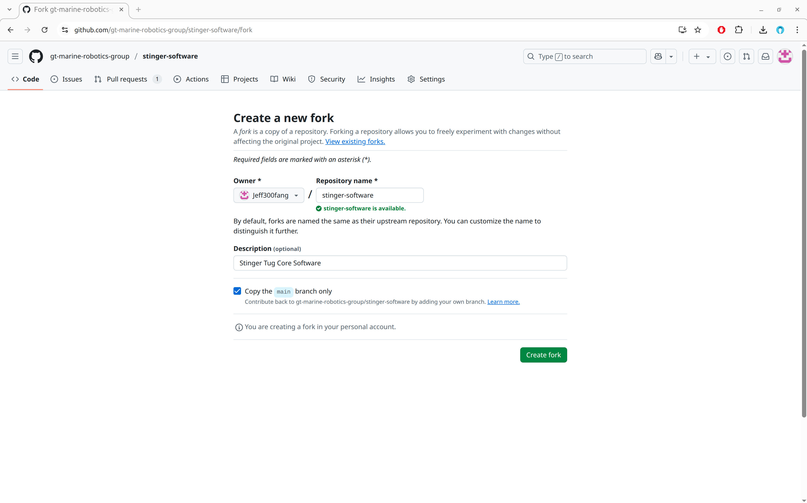

Then click `Create Fork`. Repeat this process for the `ROS_Tutorial` repo as well.


## Environment Setup 
### MRG Cluster
If you have access to the MRG Cluster, you can entire your enivornment through ssh. You will need your `user_id`, `password`, `cluster_ip`. To access, open a terminal and run:

```
ssh <user_id>@<cluster_ip>
```

### Personal Computer 

#### Ubuntu
To setup your environment (one time step), run:

```
curl -O https://raw.githubusercontent.com/Jeff300fang/MRG_Docker/tutorial/mrg_tutorial_startup.sh && bash mrg_tutorial_startup.sh
```

You will be prompted to enter your github username. Please enter the github username 

Reboot your machine. Then to start, type

```
start_tutorial_docker
```

Once inside the docker container, type:

```
tmuxp load /root/.tmuxp/tmuxp_config.yaml
```

#### Windows

## Topic 0: Building + Testing
Each topic will give a rough description of the task and there will be an associated file in ```ROS_Tutorial/student_code/student_code/topic_{topic #}/question_{topic #}_{section #}.py```. So for example, if you were working on ```Topic 1.2```, you would be accessing the file ```ROS_Tutorial/student_code/student_code/topic_1/question_1_2.py```

Each section will also have an associated autograder. At any point you want to test your code, you will need to run these commands in your workspace directory. For this tutorial, the workspace directory refers to the folder location of ```ROS_Tutorial/```.
```
colcon build
source install/setup.bash
ros2 run autograder test_topic_{topic_number}_{topic_subsection}
```
For example, to run the tests for ```topic 1.2```, you should run `ros2 run autograder test_topic_1_2`. 

**Note:** Make sure nothing is running in the background when running the autograder tests. Any background processes may mess up the autograder.

**Note:** Building your code is super important for ensuring that your latest changes are reflected when you execute your code.

## Topic 1: ROS2 Basics
<details>
<summary><strong>1.1 Understanding Nodes and Topics</strong></summary>

The goal of this section is to familiarize yourself with the concept of nodes and topics. We will be using ROS2 CLI (Command Line Interface) throughout this section.

#### 1.1.a Nodes
**Nodes:** A node in ROS2 represents a process that performs computation, such as sensing, control, planning, or actuation, and typically communicates with other nodes using the ROS2 communication framework. 

First in your terminal, run `ros2 node list`. This will list all running nodes. You should currently have 0 running nodes. Now, in the terminal, run `ros2 run helpers node_q_1_1`. After you run the node, how many nodes are now running? Change the value of `num_nodes` (in ```question_1_1.py```) to the new number of nodes. 

#### 1.1.b Node Names
Change the value of `first_node_name` to the name of the first node. Make sure you include the starting ```/```.

**Note:** When we ran the node, we used the command `ros2 run helpers node_q_1_1`. As you can see, the name `node_q_1_1` will not always 
match the name of the node. Here, `node_q_1_1` refers to the executable name, which is defined in `setup.py`.

#### 1.1.c Topics

**Topics:** A topic is a communication channel that allows for messages to be sent between nodes.
**Messages**: A message is an object that contains information such as an image, a velocity, etc.

Stop the node. This can be done by going into the terminal where you ran the node and press `CTRL + c`. Once you have killed the node,
run `ros2 topic list`. You should see two topics, namely `/parameter_events` and `/rosout`. These are system-generated topics and you do not have to worry about these topics for now. Again, run `ros2 run helpers node_q_1_1`. Change the value of `num_topics` to the new number of topics. 

#### 1.1.d Topic Info
Sometimes you may want to find information about a topic. You can use `ros2 topic info TOPIC_NAME` to do so. First, run `ros2 topic info /tutorial/OdometryPub`. Note the fields `Type`, `Publisher count`, and `Subscription count`. One of the other topics is called `/tutorial/MysteryPub`. We want to find what type of message this topic publishes. Change the value of `topic_message_type` to the correct message type of the topic `/tutorial/MysteryPub`. Write your answer as a string. For example, the answer for ```/tutorial/OdometryPub``` would be ```"nav_msgs/msgs/Odometry"```. 

#### 1.1.e Topic Echo
When debugging, it sometimes important to check out what messages are being published to a topic. A useful command for this is `ros2 topic echo TOPIC_NAME`. Change the value of `string_message` to the string that is being published to the topic `/tutorial/StringPub`. 

**Note:** do not include ```"data: "``` in your answer.
</details>

<details>
<summary><strong>1.2 Coding Subscriber and Publishers</strong></summary>

The goal of this section is to understand what a publisher and subscriber is within ROS2 and how to create them. Please look at file `question1_2.py`. You may run ```ros2 run helpers node_q_1_2.py``` to debug your answer.

#### 1.2.a Creating a subscriber to a topic

**Subscribers/Subscription:** A subscriber is a component of a node that allows the node to receive information and data from a topic.

For this question, fill in the blanks to create a subscriber.
This subscriber should
- Take in a message type `String`
- Subscribe to the topic `/tutorial/basic_topic`
- Have its callback be `self.topic_callback`
- Qos profile of 10

**HINT:** There should be four parameters that you fill

#### 1.2.b Creating a publisher
**Publishers:** A publisher is a component of a node that allows the node to send information and data to a topic.

For this question, fill in the blanks to create a publisher.
This publisher should
- Publish a message type `String`
- Publish to a topic `/tutorial/new_topic`
- Qos profile of 10

**HINT:** There should be three parameters that you fill

#### 1.2.c Message Data
Please see what the String message type consists of: https://docs.ros.org/en/melodic/api/std_msgs/html/msg/String.html.
For this question, access the string field from the variable `msg` and store it into the variable `self.topic_string_message`

#### 1.2.d Publishing Data
For this question, take the value from `topic_string_message` and append the string ` ROS` (don't forget the space). The new string should look like `Hello World! ROS`. Then use the variable `new_message` to publish this new string using the publisher from **Q1.1.b**.

</details>

<details>
<summary><strong>1.3 Counter Node</strong></summary>

This question is designed to test your knowledge on this topic. Take a look at `question_1_3.py`. The goal of this node is to publish to a topic called `/tutorial/counter25` with numbers of type `Int32` starting from 0 incrementing to 25 inclusive. A rough outline has been provided for you. Fill in the blanks to complete this question.

**HINT:** It may be useful to debug your node using `ros2 run student_code question_1_3` and `ros2 topic echo /tutorial/counter25`.
</details>

<details>
<summary><strong>1.4 Services</strong></summary>

**Services** are another type of communication mechanism. It consists of a **client** that sends a request to a **service**, which then returns a response. 
Some examples of where services may be used are:
- Querying information
- Setting parameters
- Simple one time calculations
 
For example, I may have a client that requests the position of a buoy from a mapping service.

In this question, you will be coding exactly the scenario described above. The relevant files you will be editing are `question_1_4_client.py` and `question_1_4_service.py` in `student_code` and `GetBuoyLocation.srv` in `tutorial_msgs/srv`.

#### 1.4.a Creating a Custom Message
Services require a custom message to work. Take a look at `tutorial_msgs/srv/GetBuoyLocation.srv`. You'll notice that there are two fields in this message seperated by a `---`. The first field represents the request data the client sends to the service. The second field represents the response data that the service sends back to the client.

For this message, we want the request to be a variable of type `string` with the name `buoy_name`. For the response, we want three variables, two of type `float32` and one of type `bool`. The first `float32` should be called `x_pos` and the second one called `y_pos`. The `bool` should be called `found`, Fill out the blanks in the provided file.

**HINT:** Take a look at `TemplateServiceMessage.srv` to see a template service message.

#### 1.4.b Creating a Serivce

Create the service. This should use the `GetBuoyLocation` service message, use the service topic `/tutorial/get_buoy_location`, and have its handler be `self.handle_get_buoy_location`.

#### 1.4.c Handling a request from a Client

Go to the file `question_1_4_service.py`. Complete the `handle_get_buoy_location` function. An example of how to access the request component of the service is provided for you. Following this example, fill out the response. If the requested buoy is not in the map, set the `found` parameter to `False`, else if found set the parameter to `True`.

#### 1.4.d Sending a request to a Service

Go to the file `question_1_4_client.py`. Correctly request a `yellow_buoy` from the service. 
</details>

## Topic 2: Simulation + Useful Tools

**Note:** There are no tests for this section.

<details>
<summary><strong>2.1 Using VNC</strong></summary>

**VNC (Virtual Network Computing)** is a graphical desktop-sharing system that allows you to access another desktop's enviornment over a network.

In our case, we will be accessing the docker container's generated desktop environment. To do so, go into your web browser and type `localhost:6080`. This should bring you to a webpage that looks something like the below image.

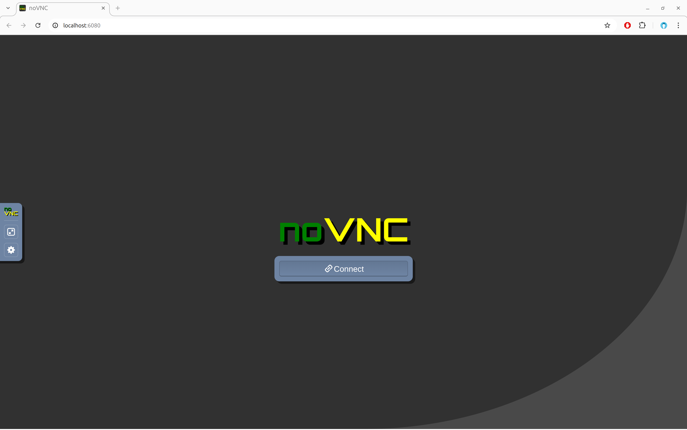

Press connect and you should have access to your docker container's VNC.
</details>

<details>

<summary><strong>2.2 Running Simulation</strong></summary>

In your terminal, run `ros2 launch stinger_bringup vehicle_sim.launch.py`. You should see something along the following:

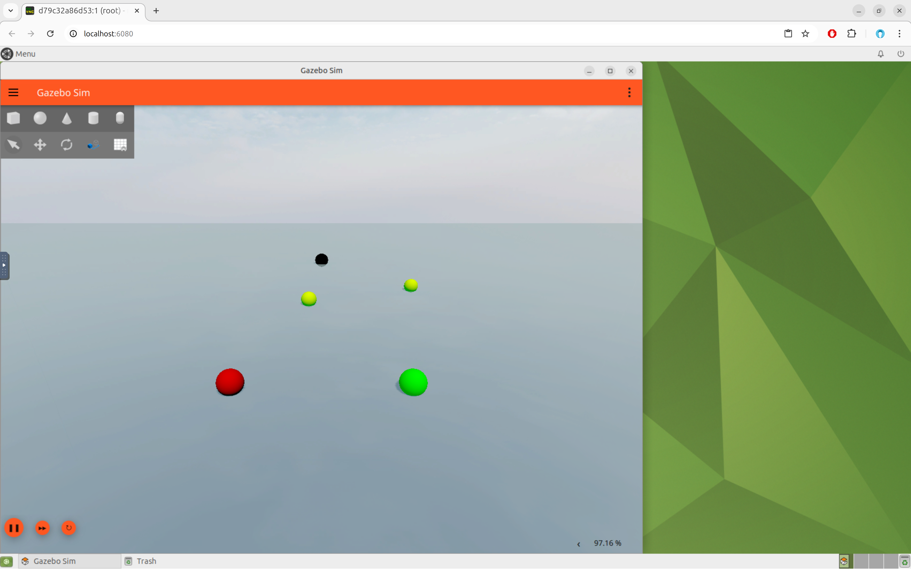

If you zoom out, you should be able to see a stinger tug model.

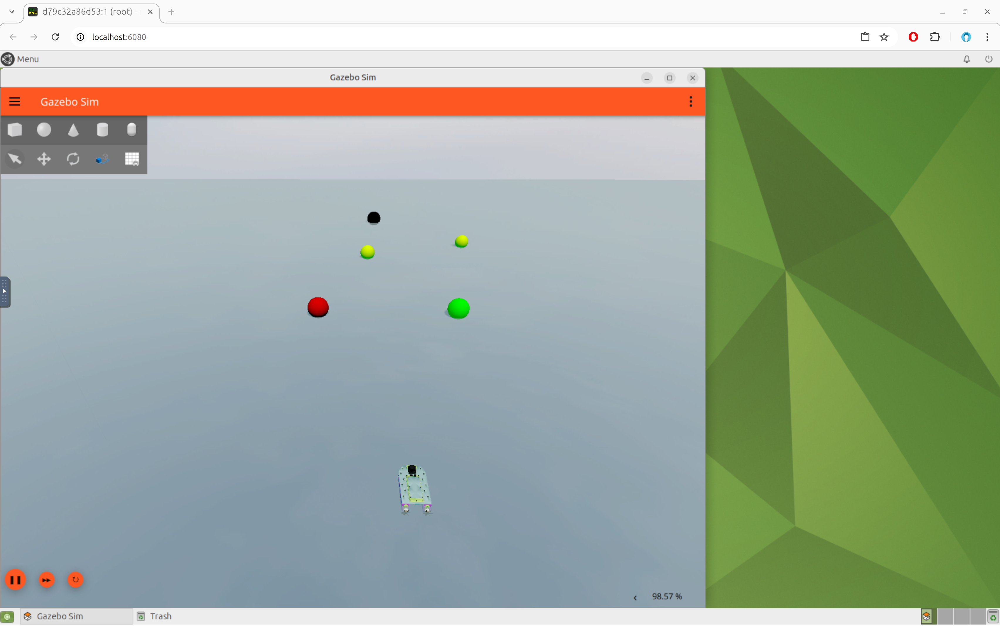

Later in this tutorial, you will be developing different algorithms for perception, control, and autonomy. You may want to test these out in different environments. To do so, you can run the sim launch command with the `world:=` parameter. For example, if you wanted to run a different world called `secondary.world`, you would run the following

```
ros2 launch stinger_bringup vehicle_sim.launch.py world:=secondary.world
```

All of the available worlds can be found in `stinger-software/stinger_sim/worlds`.

</details>

<details>
<summary><strong>2.3 rqt_image_view</strong></summary>

**rqt_image_view** is a tool used to see images being published over topics.

First start the simulation `ros2 launch stinger_bringup vehicle_sim.launch.py`.

Then, in a separate terminal, run `ros2 run rqt_image_view rqt_image_view`. You should see something like this:

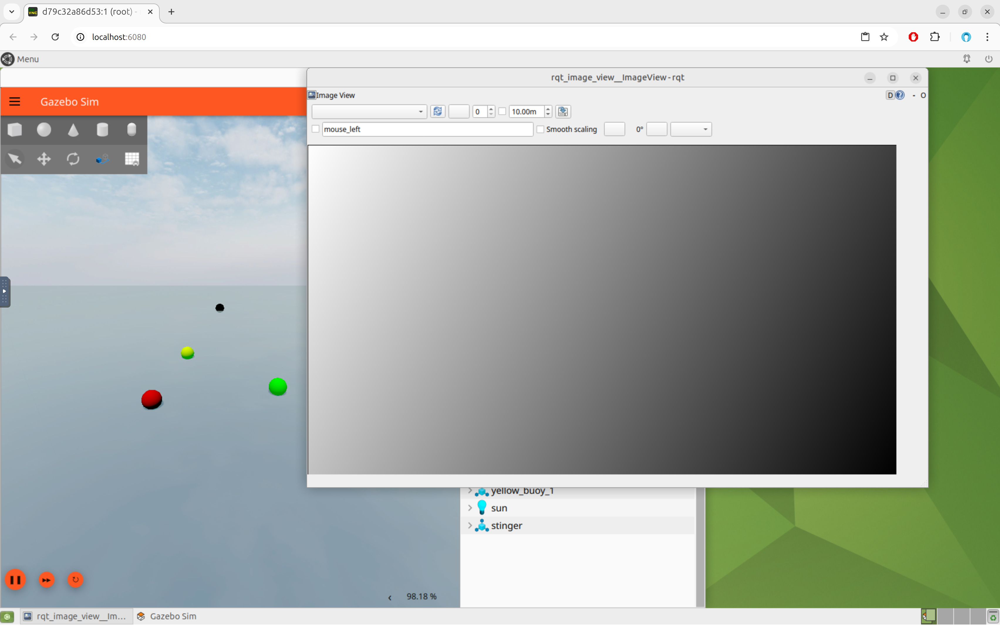

Select the dropdown.


**Note:** If nothing pops up in the dropdown, click the refresh button right next to the dropdown a couple of times and try again.

Then select the camera topic you want to visualize. In our case, select `/stinger/camera_0/image_raw`. You should see something like the following.

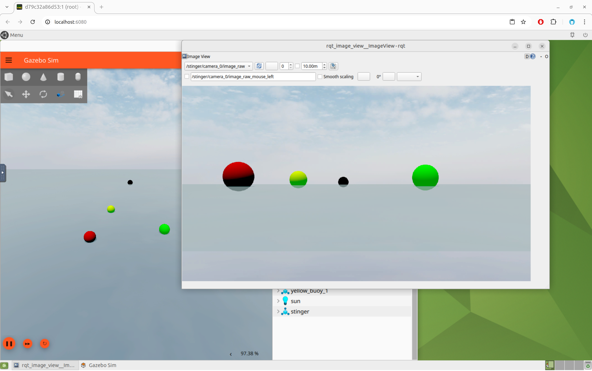

</details>

<details>
<summary><strong>2.4 Rviz2</strong></summary>

**rivz2** is a 3D visualization tool for various parts of the robot that include sensor data, transformations, markers, robot models, etc.

Make sure the simulation is launched. Then in another terminal, type `rviz2`. You should see something like this:

**Note:** sometimes we refer to `rviz2` as simply `rviz`.

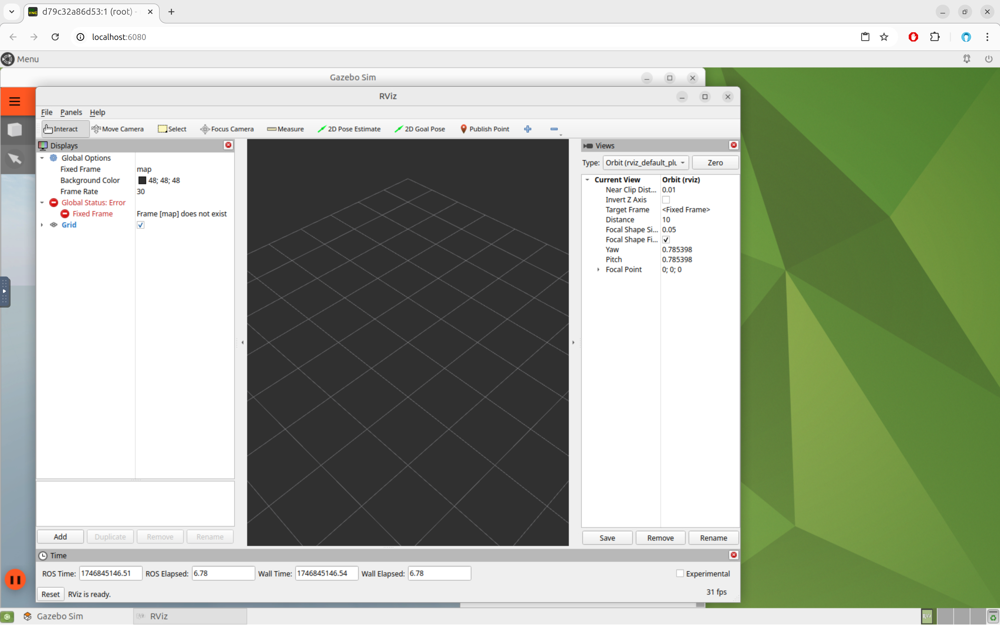

We are going to display the data coming from the lidar sensor. First, click add in the bottom left corner.


This will list out the different type of information you can visualize using rviz. Next, click the `By topic` tab.

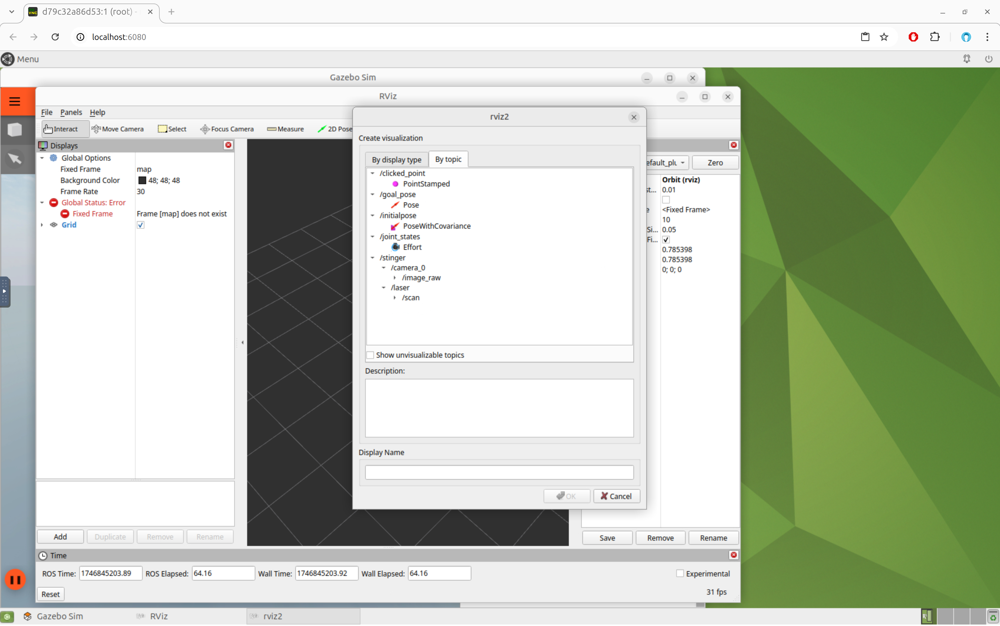

This will list out the current topics from the robot that can be visualized. We want to visualize the lidar, so click the dropdown `/scan` and then select `LaserScan`

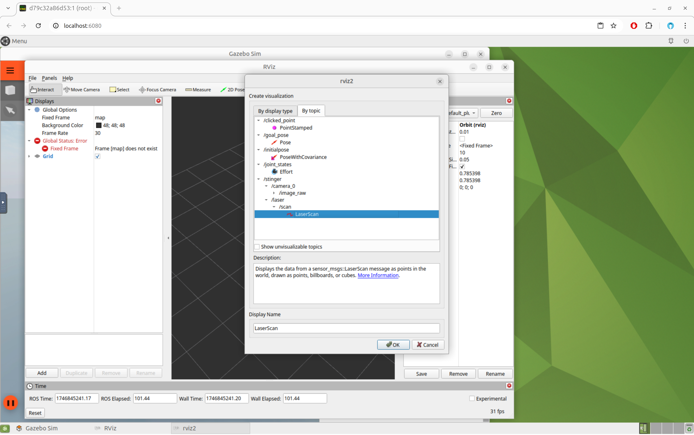

Next we need to change the `Fixed Frame` from `map` to `base_link`. We will learn more about what these mean in a later section.

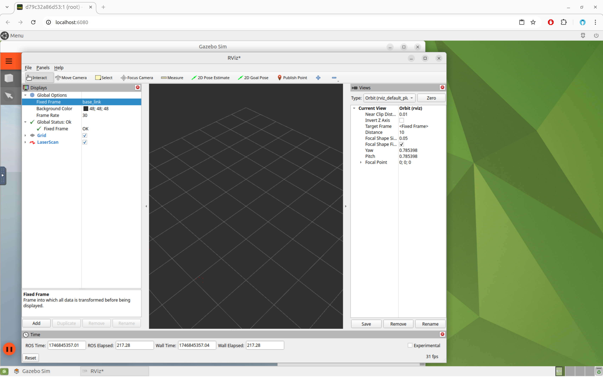

Now, you should see some extremely small red dots in the grid. To make them more visible, we can select the `LaserScan` dropdown and increase the `size` to `0.1`.

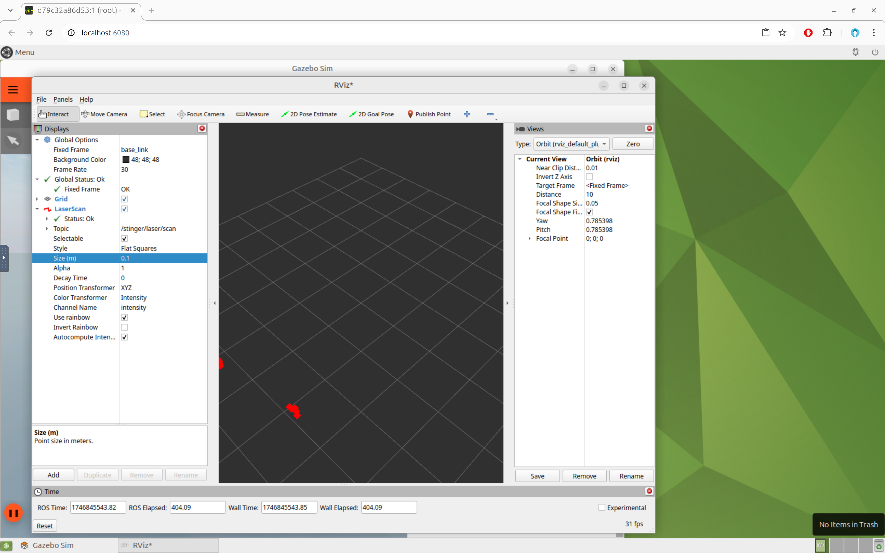

Now you should be able to see these red squares. We will learn more about what a Lidar sensor is in a later section.

</details>

<details>

<summary><strong>2.5 rqt</strong></summary>

</details>

## Topic 3: Conventions

<details>

<summary><strong>3.1 Unit Conventions</strong></summary>

**Distance:** meters (m)<br>
**Angle:** radians (rad)<br>
**Time:** seconds (s)

</details>

<details>

<summary><strong>3.2 Coordinate Conventions</strong></summary>

Coordinate conventions are used to ensure consistent interpretation of spatial data (like position, velocity, etc.) across different systems. So for example, if I said a point was at position `(2, -3, 0.5)` relative to me, coordinate conventions would define which variable means "forward", which variable means "up" or "down", does the negative mean "left" or "right" etc.

ROS uses the right-handed coordinate system. The most important coordinate convention is the relative-to-body convention.

We will use your right hand to demonstrate the relative-to-body convention.

#### 3.2.a Linear Coordinate Conventions
For this topic, we will cover the convention for linear coordinate frames (such as position, velocity, acceleration, etc). Following the example, say I give you a point at position `(2, -3, 0.5)` relative to you. Make this gesture with your right hand with your pointer finger pointing forward.

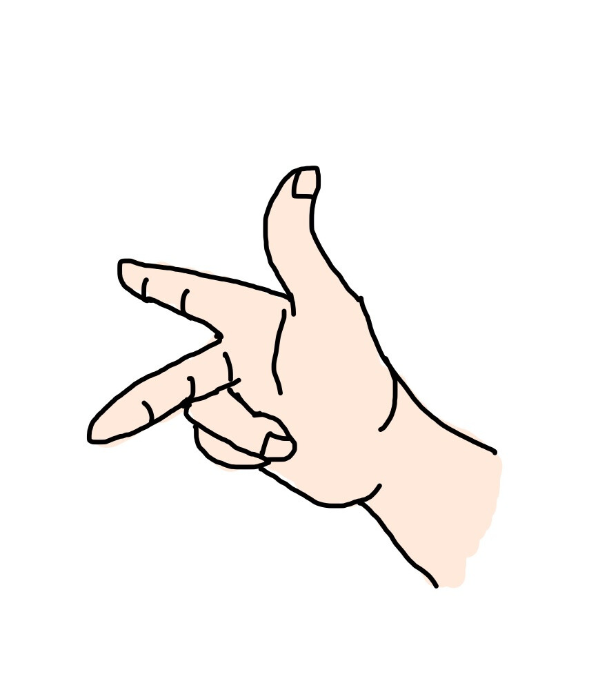

Your index finger represents `x`(forward/backward) and the direction your finger is pointing is considered the positive direction. So, `x = 2` means the object is 2 meters in front of you. Your middle finger represents `y`(left/right). So, `y = -3` means 3 meters to the right of you. Your thumb represents `z`(up/down). So, `z = 0.5` means 0.5 meters above you.

**Note:** In aerospace we use different terms instead of `x`, `y`, `z` when representing linear motion, namely, `surge`, `sway`, `heave`.

In a terminal, run `ros2 launch stinger_bringup vehicle_sim.launch.py world:=grid.world`. You should see a simulation with a grid overlayed on top of the world. Each box represents 1 meter by 1 meter. Look at `question 3.2.a` in `question_3_2.py`. Assign each variable with the correct pose of each buoy using the relative to body convention to the stinger tug.

**Note** For this question, ignore the z-axis and all orientation axes.

**Hint**: [Pose definition](https://docs.ros.org/en/noetic/api/geometry_msgs/html/msg/Pose.html)

#### 3.2.b Angular Coordinate Conventions

The 3 rotational degrees of freedom in the body frame are `roll`, `pitch`, and `yaw`, which represent the rotation about the X-axis, Y-axis, and Z-axis respectively. The image below gives a good visual representation of these rotational axes.


To determine the directionality of an angle, we must use the right hand rotation convention. For example, say we want to determine the positive direction of the roll axis. To do so, make this gesture with your right hand.

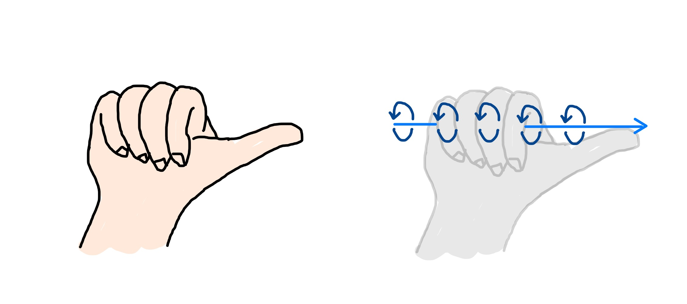

Since the roll axis corresponds with the X-axis, point your thumb forward (where your pointer finger would have pointed with the right hand rule). Then, curl your hand in the direction that your fingers point (use the figure as reference). This corresponds to the positive direction.

**Note:** The directionality of the angular axes in the plane diagram are wrong.

Again, in a terminal, run `ros2 launch stinger_bringup vehicle_sim.launch.py world:=grid.world`. Look at `question 3.2.b` in `question_3_2.py`. Assign each variable with the correct yaw angle of each buoy w.r.t (with respect to) the stinger-tug using the above convention.

**Hint** Use your answers from question `3.2.a` and `np.arctan2`.

</details>

<details>
<summary><strong>3.3 TF Frame Conventions</strong></summary>

TF (transform) Frames define how different components move relative to each other. 

In a terminal, run `rviz2` and `ros2 launch stinger_bringup vehicle_sim.launch.py`. 

In `rviz`, first ensure that you have the `base_link` frame selected.

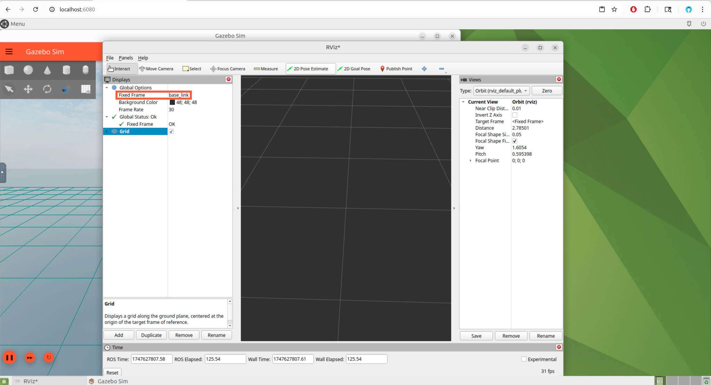

Then click `Add` -> `TF`. Expand the `TF` on the side bar and enable `Show Names`. You should see something along the following.

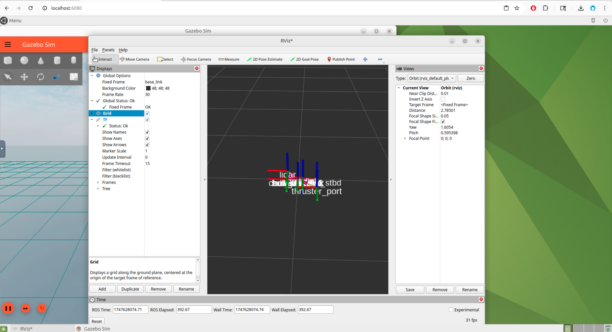

What you are seeing are the current TF frames being displayed. Go to `Frames` and disable all the frames except for `base_link`. You should see something like this:

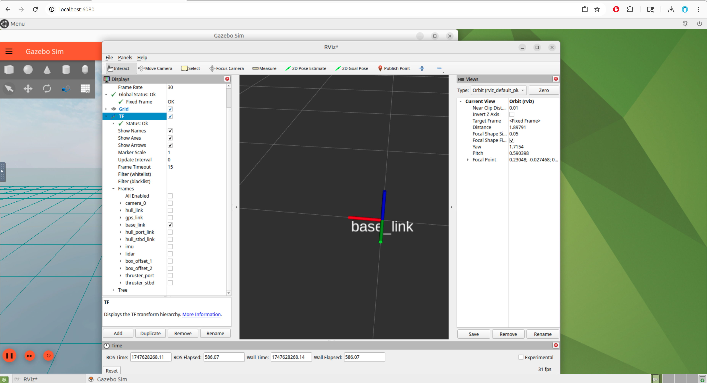

The most basic frame is called the `base_link`. This is the robot's base frame and typically represents the center of the robot. As you can see, the `base_link` follows the right hand coordinate convention, with red representing `x`, green representing `y`, and blue representing `z`. 

All components, such as sensors and thrusters, are defined w.r.t the `base_link`. Enable the `camera_0` frame. You should see something like the following:

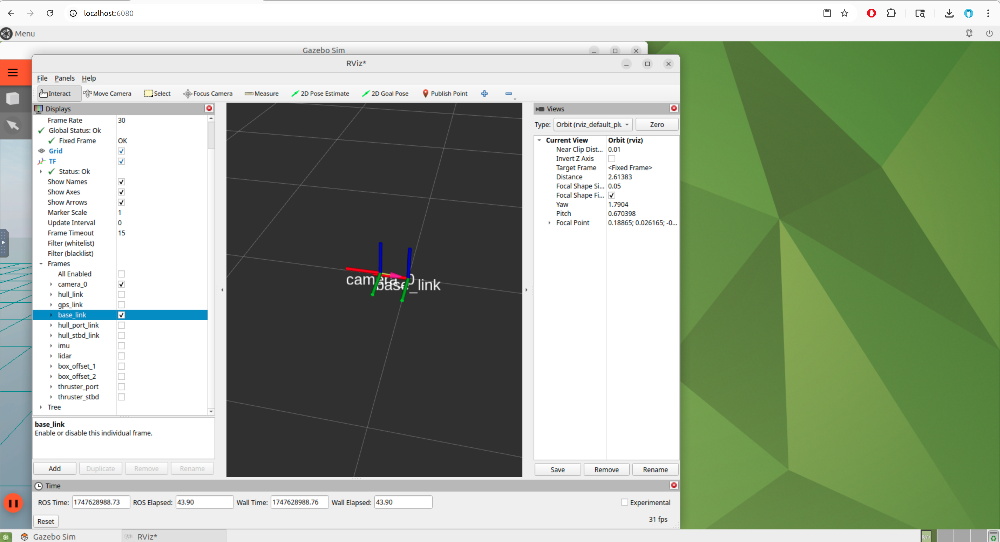

Notice that the camera frame falls infront of the `base_link` frame. This is because the camera is positioned forward of the center of the stinger tug. It is important to define these TF Frames because we can use these to properly transform any data coming from the camera into the relative body frame (`base_link`).

Two other very important coordinate frames are the `odom` and `map` frame. The `odom` frame is typically used to represent where the robot thinks it has moved to w.r.t where it started. The odom frame is always centered to where the robot started. The `map` frame is typically used to represent the robot's position in the environment and is supposed to be a global fixed frame. The `map` frame does not have to be centered to where the robot started.

</details>

## Topic 4: Localization 

<details> <summary> <strong> 4.0 Localization </strong></summary>

In the context of robotics, localization refers to the process by which a robot determines its pose (position and orientation) within its environment. The robot may use sensors such as an IMU, GPS, or cameras to do so.

</details>

<details> <summary> <strong> 4.1 Odometry </strong> </summary>

When dealing with localization, we commonly use the [Odometry Message Type ](https://docs.ros.org/en/noetic/api/nav_msgs/html/msg/Odometry.html) to encapsulate our localization information. This message contains a `pose` (position) and a `twist` (velocity) field with a covariance matrix. The covariance matrix represents the uncertainty in our estimation for that field. So for example, a high covariance for our `pose` would mean that we have high uncertainty about the accuracy of our estimated position. We will see the covariance matrix's importance in a later section.

</details>

<details> <summary> <strong> 4.2 IMU</strong></summary>

An Inertial Measurement Unit (IMU) is a sensor used to measure a robot's acceleration (accelerometer), angular velocity (gyroscope), and orientation (magnetometer). They usually look something like the following.

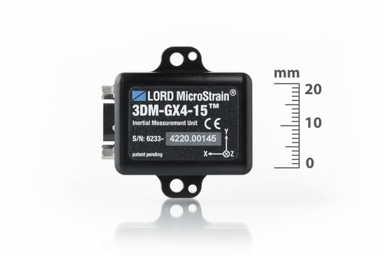

For the following sections, we will be breaking down the standard IMU message type. See [here](https://docs.ros.org/en/noetic/api/sensor_msgs/html/msg/Imu.html).

#### 4.2.a IMU Message: Linear Acceleration

The linear acceleration field of the IMU is composed of a 3D vector, representing the linear acceleration captured by the IMU in the `x`, `y`, and `z` directions in the IMU frame. 

**Note:** The IMU will usually capture the effet of gravity. Because of this, even when the IMU is stationary, we will see a linear acceleration of +9.81 m/s^2 in the heave direction of the robot.

In seperate terminals, run the following:

```
ros2 launch stinger_bringup vehicile_sim.launch.py
ros2 topic echo /stinger/imu/data --field linear_acceleration --no-arr --once
```

Notice how when displaying the linear acceration for the IMU the acceleration in the `z` direction is around `-9.81`, when it should be `+9.81`. This is because the IMU measures data in its local coordinate frame which may not match up directly with the robots coordinate frame. We will explain this in the next section.

#### 4.2.b IMU Message: TF Frames

Reference the above picture of the IMU. In the bottom right corner, you can see that there are 2 arrows representing the `x` and `y` directions. The `z` direction is denoted by an cross symbol to represent that the `z` axis is pointed into the plane. See the below as reference.


The left represents a vector into the plane, the right represents a vector out of the plane. 

Notice that the IMU's coordinate axes follow the right hand rule. These axes represent the IMU's local sensor frame. Look at the TF frames of the stinger tug in the picture below.

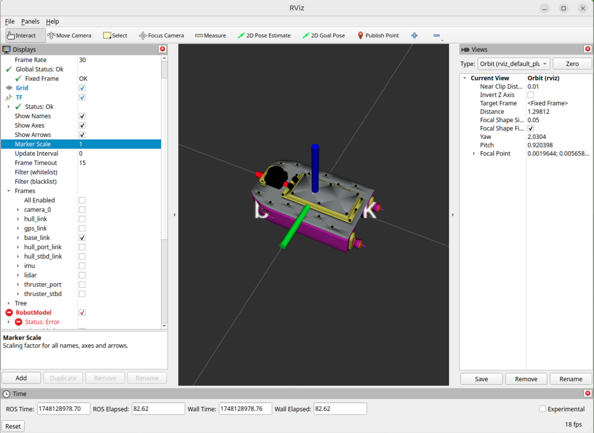

As a reminder, this is what the base_link frame looks like w.r.t to the stinger tug.

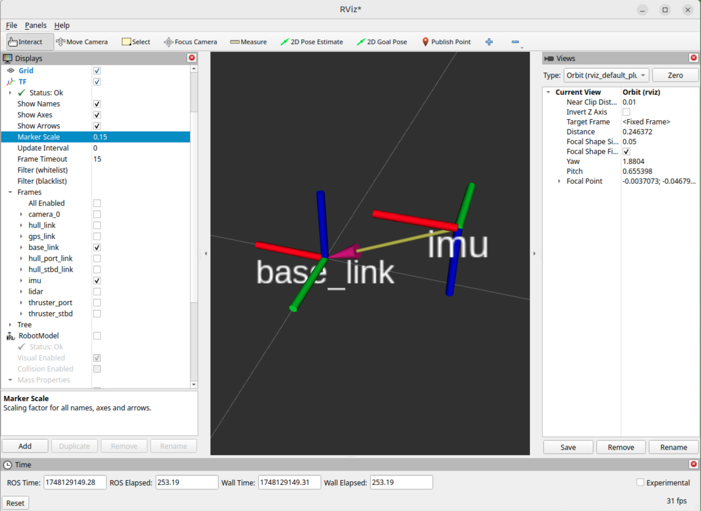

Notice that the imu frame is upside down w.r.t to the base_link frame. This is because of how the IMU is mounted inside of the stinger tug and explains why we were seeing a negative gravity acceleration when we should have seen a positive one.

In `question_4_3.py`, look at the `transfrom_imu(self, msg: Imu)` function. It is okay if you do not completely understand everything in the function. If you ever find yourself needing to do something similar in the future, you can copy paste this function and modify it to fit your needs. This function will take an incoming IMU message in its local frame, and convert all of its data to be in the base_link frame.

In seperate terminals, run the following:

```
ros2 launch stinger_bringup vehicile_sim.launch.py
ros2 run student_code question_4_3
ros2 topic echo /debug --field linear_acceleration --no-arr --once
```

Now, notice how the linear acceleration in the `z` direction correctly outputs `+9.81`.

By converting the IMU into the base_link frame, it is now easier to use the IMU to localize the stinger tug. It is common for sensors to be in a different frame than the base link frame. To make the data more useful, you will usually have to go through a similar process to convert it into the base link frame.

#### 4.2.b IMU Message: Orientation

Look at the orientation field of the IMU message. Notice that the field type is an Quaternion. A quaternion is a different way of representing angles compared to euler angles (your standard roll, pitch, yaw, [-pi, pi]). Quaternions are often preferred over euler angles in robotics since they have some nice mathematical properties and avoid some common problems with euler angles. If you want a more in depth explanation see [here](https://en.wikipedia.org/wiki/Quaternion). 

Quaternions are reprenseted in a 4D space, which is difficult for us to interpret. This is why we commonly convert quaternions back into euler angles when needing to work with them for intuitive tasks, such as, what angle is the buoy from my stinger tug.

A useful tool for visualizing quaternions is to use `plotjuggler`. In seperate terminals, run the following:

```
ros2 launch stinger_bringup vehicle_sim.launch.py world:=empty.world
ros2 run student_code question_4_3
ros2 run plotjuggler plotjuggler
```

When you open it up, you should see something like this:

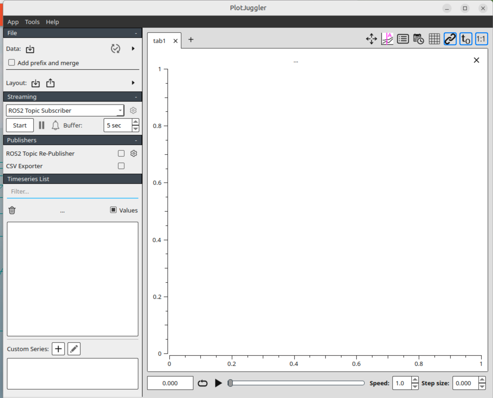

Click `Start`

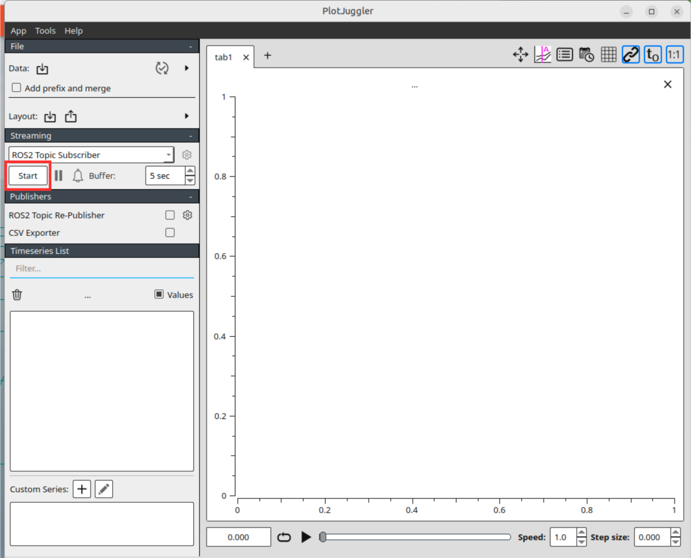

Select the `debug` topic to visualize and press `Ok`.

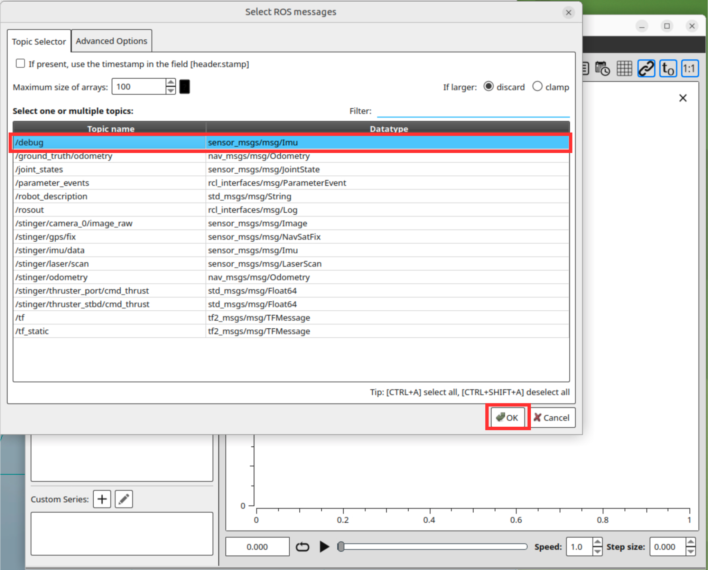

Expand the `debug` field and expand orientation.

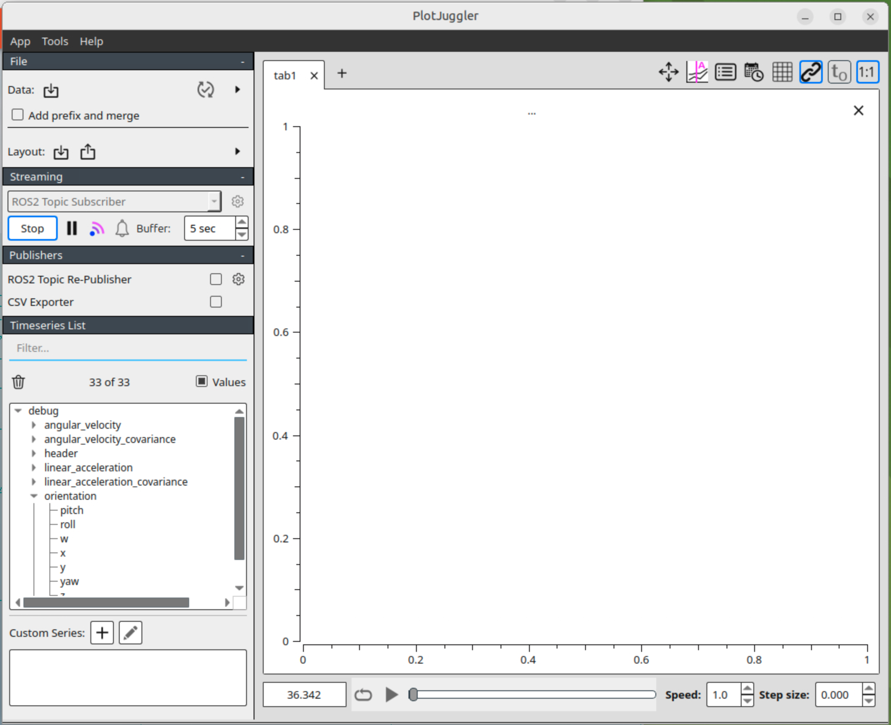

Right click the empty space.

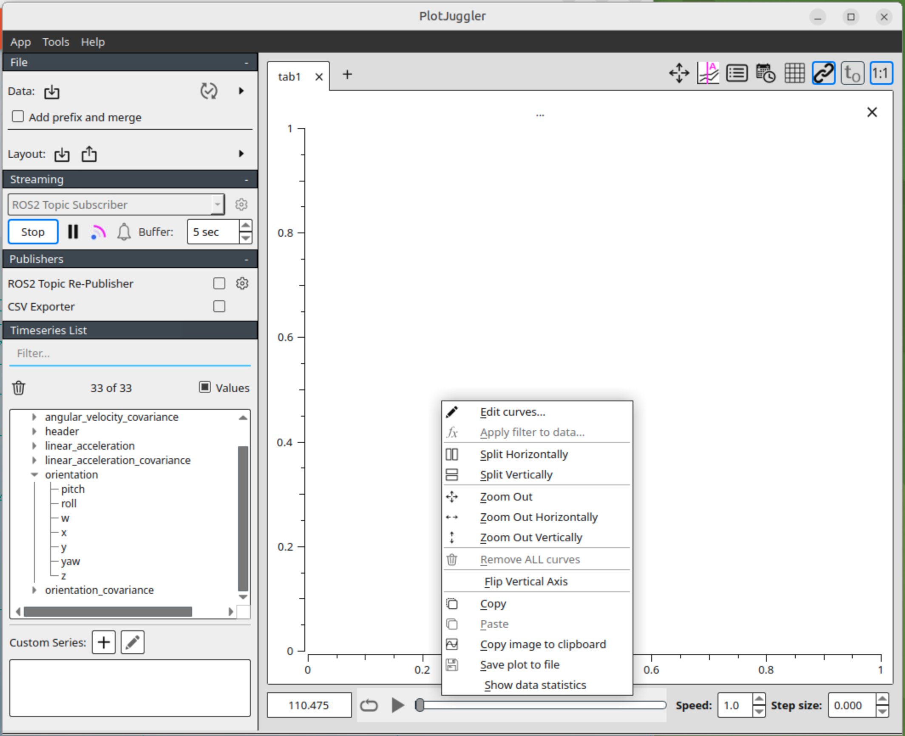

Select the `Split Vertically` option. Do this again and you should have something like this. 

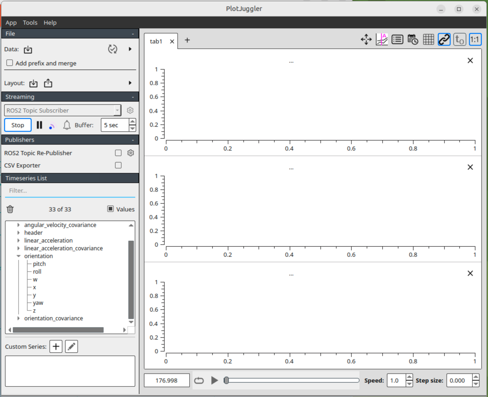

Then from the left hand side under orientation, drag the `roll` field into the top plot, `pitch` into the middle plot, and `yaw` into the bottom plot. You should see something like this:


Each plot displays each euler angle as a function of time. 

Keep everything running, in a seperate terminal, run:

```
ros2 run helpers node_q_4_2
```

Notice that as the stinger turns left, the yaw positively increases, which correctly follows the relative to body convention.

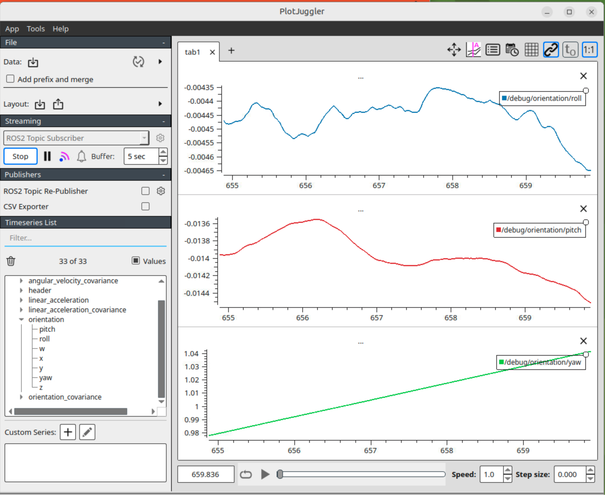

#### 4.2.c IMU Message: Angular Velocity

The last part of the IMU message is the angular velocity. There are three values, representing the angular velocity in the `x`, `y`, and `z` direction in radians/second.

</details>

<details><summary><strong>4.3 Dead Reckoning</strong></summary>

Dead reckoning is a navigation technique used to localize a vehicle by calculating its position by tracking speed, direction, and time traveled.

#### 4.3.a Odom Frame

Run the following:

```
ros2 launch stinger_bringup vehicle_sim.launch.py world:=empty.world
ros2 run student_code question_4_3
ros2 run plotjuggler plotjuggler
```

Select the `/debug` topic to visualize and plot the linear acceleration in the `x` and `y` directions. You should see something like this.

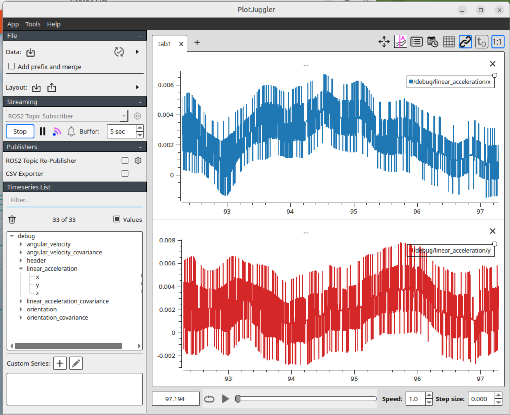

Then in a terminal, run

```
ros2 run helpers node_q_4_2
```

Take a look at your `plotjuggler` graph, you should see something like this:

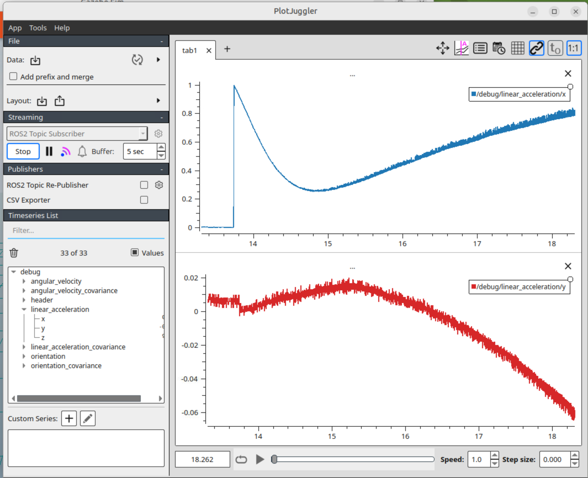

Now look at the simulation, you should see that the stinger tug is going forward and to the left. However, our plot juggler graphs are showing us that our stinger tug is accelerating to the right. This must mean that even after transforming our IMU into the 
`base_link` frame, there is something still wrong.

This is where the `odom` frame comes in. If you don't remember its definition, check out `3.3 TF Frame Conventions`. When we talk about localization, we always discuss it in the `odom` frame. This `odom` frame will origin its coordinate frame where the `base_link` frame starts (where the robot initializes). To better outline the difference between the `base_link` frame and the `odom` frame, follow this example of an IMU transformed to the `base_link` frame vs the `odom` frame.

| English     | base_link POV | odom POV |
|-------------|-------------|-------------|
| Robot moves forward 1 meter     | Robot moves 1 meter along its x-axis  | (0, 0) -> (1, 0)  |
| Robot turns 90 degrees to the left  | Robot turns 90 degrees to the left  | Robot faces 90 degrees to the left  |
| Robot moves forward 2 meters | Robot moves 2 meters along its x-axis  | (1, 0) -> (1, 2)  |
| Robot turns 45 degrees to the left  | Robot turns 45 degrees to the left  | Robot faces 135 degrees to the left|

To correctly localize ourselves, we must convert our `base_link` measurements into the `odom` frame. With an IMU, this involves using the IMU's orientation to rotate the `linear_acceleration` and `angular_velocity`. Look at `question_4_3.py`, complete `4.3.a Odom Frame IMU` by rotating the `linear_acceleration` and `angular_velocity` from `msg_base_link` with `msg_base_link.orientation`. 

**Hint:** Use the code in `transform_imu` as reference.

#### 4.3.b IMU Dead Reckoning

As you might recall from physics, acceleration is the change in velocity (derivative) and velocity is the change in position. Therefore, given the linear acceleration from the IMU, we can integrate the linear acceleration to get velocity and integrate the velocity to get position. As a reminder,

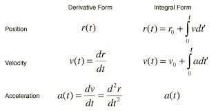

Look at `question_4_3.py`, complete `4.3.b IMU Dead Reckoning`. For this question, we want to publish to the topic `/stinger/odometry` an odometry message containing the following fields:
- frame_id
- child_frame_id
- twist
- pose

For all fields relating to heave, you can set it to 0. Also, disregard the covaraince fields. A topic called `/ground_truth/odometry` is given to you which you should use to verify your computation. 


To run your code and verify, run in seperate terminals:

```
ros2 launch stinger_bringup vehicle_sim.launch.py world:=empty.world
ros2 topic echo /ground_truth/odometry --no-arr
ros2 run student_code question_4_3
ros2 topic echo /stinger/odometry --no-arr
ros2 run helpers node_q_4_2
```

You may also find it useful to use `plotjuggler` to visualize your output.

**Hint:** Use the variables defined in the constructor.

**Note:** IMU's are rarely solely used to localize a vehicle. This is because IMU's typically experience something called IMU drift, where over time, the IMU will accumulate error that gets exponentiated through integration in the velocity and position estimates. The reason it works in simulation is because the IMU's are almost ideal and errorless.

</details>

<details> <summary> <strong> 4.4 robot_localization</strong></summary>

#### 4.4.a Integrating IMU in robot_localization

In section 4.3, we estimated our odometry using only one odometry source (the imu). Now what if we have multiple IMUs and other odometry sources (such as a GPS) each in their own frame. For example, at a given time our IMU might think that we are at position (3.0, 4.2), while our GPS thinks that we are at position (3.1, 4.0). So how should we fuse this data together?

`robot_localization` is a package that provides a node called `ekf_node`. If you're interested in deeply understanding what an Extended Kalman Filter is, a good resource is [MIT Tutorial: Kalman Filter](https://web.mit.edu/kirtley/kirtley/binlustuff/literature/control/Kalman%20filter.pdf) (not mandatory). The general idea is that the `ekf_node` will fuse a set of unreliable/weak odometry sources and form a stronger estimate of our odometry. It will also take care of all tf transforms as long as they are defined and broadcasted.    

Take a look at `stinger-software/stinger_bringup/config/ekf.yaml`. This config file will define the parameters for the `ekf_node`. The most important parameter in this config file is defining which fields (see below) from each odometry source should be used in our estimate. This is important because for example, our IMU doesn't natively report our `x_pos` or `y_pos`. Because of this, the `ekf_node` needs to know to ignore these fields.

```
[x_pos   , y_pos    , z_pos,
 roll    , pitch    , yaw,
 x_vel   , y_vel    , z_vel,
 roll_vel, pitch_vel, yaw_vel,
 x_accel , y_accel  , z_accel]
```

In the `ekf.yaml`, look at the `4.4.a Example`. This array defines which fields should be used. Each boolean value in the array corresponds to an odometry field in the above array. So in this example configuration, we enable feeding the `x_pos`, `y_pos`, and `yaw` into the ekf (this configuration is not right, just an example).

Look at `TODO: 4.4.a Integrating IMU in robot_localization`. Following from the example, correctly define which odometry fields should be fed into the ekf from the IMU.

**Note:** Exclude linear acceleration (among other things). This means your last 3 values should be false.

**Hint:** What fields are defined in the IMU message? You should be using all of them.

To run the tests:

```
ros2 launch autograder test_4_4.launch.py
```

#### 4.4.b GPS and Navsat Node

Launch the simulation and run

```
ros2 topic echo /stinger/gps/fix
```

The message over this topic is of type [NavSatFix](https://docs.ros.org/en/noetic/api/sensor_msgs/html/msg/NavSatFix.html). Notice how our position is given in terms of longitude and latitude. Out of the box, this isn't useful to us because we need our position in terms of x and y in meters. To handle this, `robot_localization` provides a node called `navsat_transform` that will transform a `NavSatFix` message from a gps into an `Odometry` message that we can more easily use.

The `navsat_transform` node requires the following topics: `/imu`, `/gps/fix`, and `/odometry/filtered` (you can ignore this one for now). But, the topics for our sensors are `/stinger/imu/data` and `/stinger/gps/fix`. This is where topic remapping comes into use.  

Look at `stinger_bringup/launch/localization.launch.py` `TODO: 4.4.b Navsat Node`. In the arguments of the second `Node` definition, there is a parameter named `remappings`, which is an array of tuples. An example is given of how to remap a topic. For this question, correctly remap the imu and gps topics.


To run the tests:

```
ros2 launch autograder test_4_4.launch.py
```

#### 4.4.c Everything Together

Now with our GPS converted into odometry, we want to fuse this with our IMU to form a strong odometry estimate. 

In seperate terminals, run:


```
ros2 launch stinger_bringup vehicle_sim.launch.py
ros2 launch stinger_bringup localization.launch.py
ros2 topic echo /odometry/gps
```

Publish commands to the motors using `rqt` and take note of which odometry fields from `/odometry/gps` are relevant. This is important because some fields (such as orientation) are left 0 and we do not want to include these invalid fields into our ekf.

Again, take a look at `stinger-software/stinger_bringup/config/ekf.yaml`. Following the structure of the IMU config, add the config for the GPS with only the relevant odometry fields.

</details>

<details> <summary> <strong> 4.5 Localization Wrap-up</strong></summary>

Take a look at `stinger_bringup/launch/vehicle_sim.launch.py`. Follow the instructions and uncomment the code block.

Then, in seperate terminals run,

```
ros2 launch stinger_bringup vehicle_sim.launch.py
ros2 run plotjuggler plotjuggler
rqt
```

In plotjuggler, click `Start` and select these two topics.

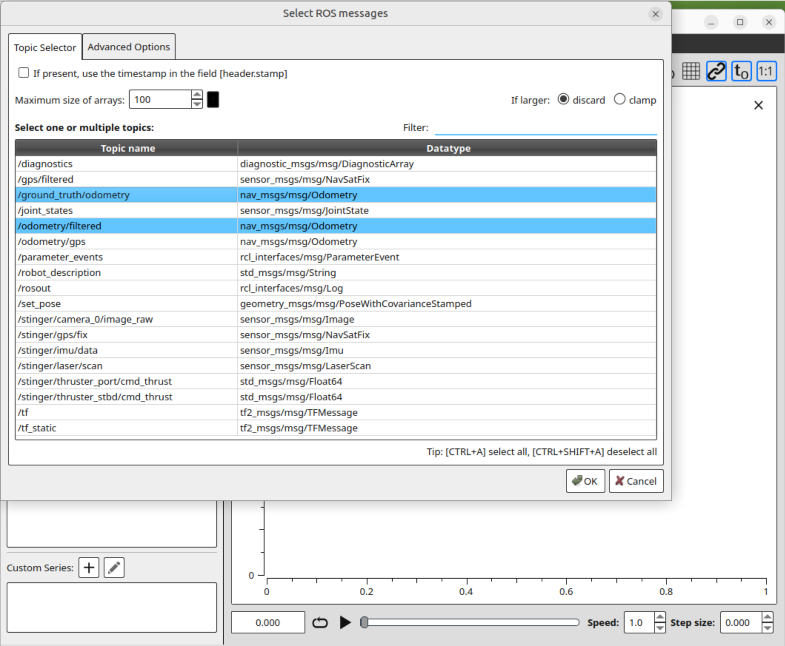

Vertically split the plots.


Then, expand the `ground_truth` topic until you see `position x y`. Shift click `x` and `y`.

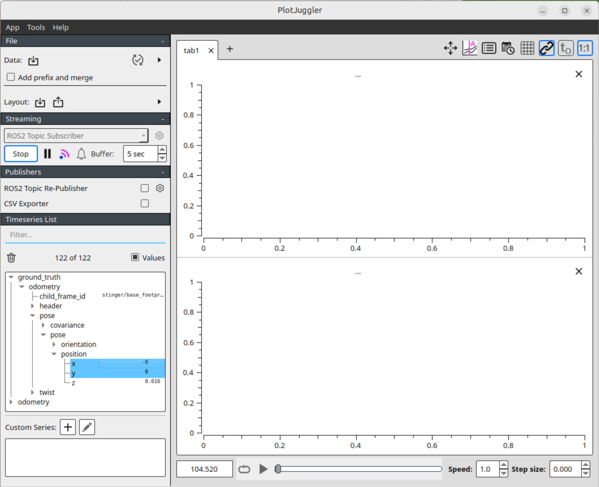

Then, right-click the fields. While continuing to hold down the right-click, drag the fields onto a plot. Then click OK.

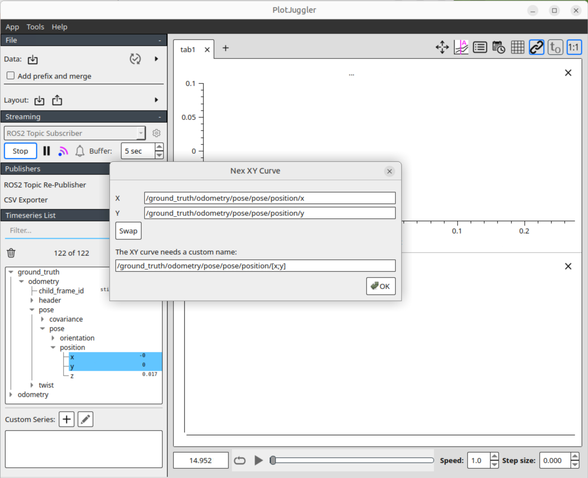

You should see something like this.

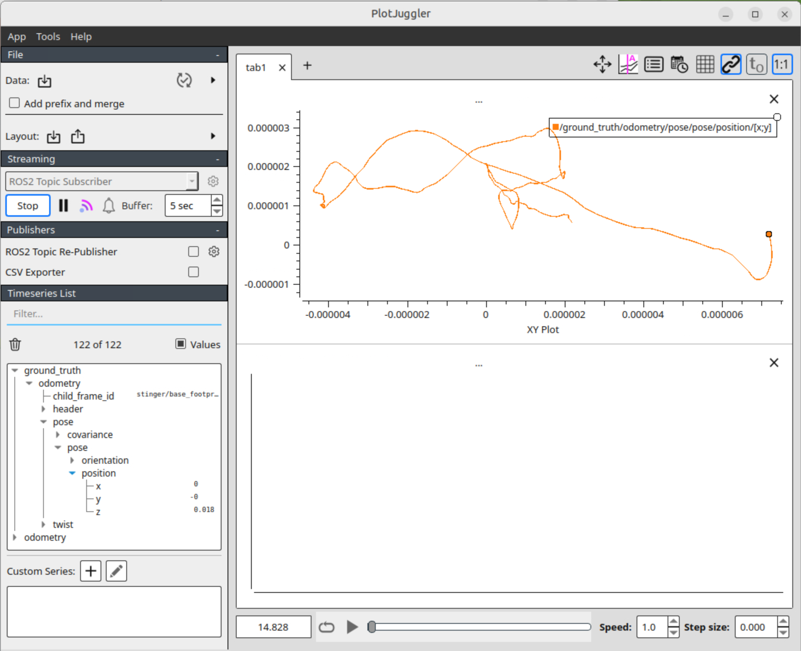

Repeat this process for `/odometry/filtered`. You should see something like this.


Now, using rqt, publish anything to the motors. You should see that the two curves are roughly the same.

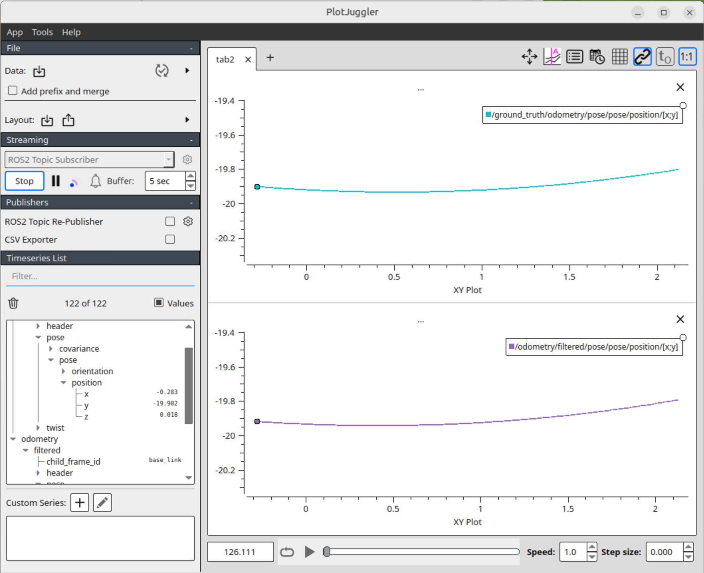

If everything looks good, congratulations! You just localized the stinger-tug.

</details>

## Topic 5: Control 

<details>
<summary><strong>5.0 Overview</strong></summary>

You may choose to skip over this section. Those seeking a deeper understanding may want to go through this section. Very generally, Control refers to how we command the robot to move in order to accomplish something. 

There are three main levels of control. <br>
**Low Level Control:** This involves sending commands (rotational speeds) to the motors to make the robot achieve a specific target velocity. <br>
**Mid Level Control:** This involves commanding velocities to make the robot follow a path. <br>
**High Level Control:** This involves creating a path that the robot should follow. This is often coupled with autonomy.

Let's walk through a real life example. Say you're a driving your car and you want to get from your apartment to your friend's house. You may use Google Maps to get directions to their house. In this scenario Google Maps is the **High Level Controller** because it creates a path (a set of directions) to their house. You, the driver, are both the **Mid Level Controller** and the **Low Level Controller.** While driving, you control the speed and direction of the car to follow the path created by Google Maps; this is **Mid Level Control.** To drive a certain speed along the road, you control the gas; this is **Low Level Control.**

The main idea is that commands cascade from the top-down. For example, the high level controller provides a path to the mid level controller. Then the mid level controller provides a velocity to the low level controller to follow the path. Then the low level controller acts to actually move the robot.

In this topic, we will be covering **Low Level Control** and **Mid Level Control**.
</details>

<details>
<summary><strong>5.1 Low Level Control</strong></summary>

#### 5.1.a Throttle Controller

Take a look at `stinger_controller/throttle_controller.py`. This node handles converting command accelerations to thruster speeds.The logic in this code is quite advanced, so feel free to just briefly skim over this node.

#### 5.1.b Velocity Controller

Take a look at `stinger_controller/velocity_controller.py`. This node will take in a command velocity and publish an acceleration. This controller is a PID controller. 

#### 5.1.c PID Control System


PID is a control algorithm that is a closed loop system (uses feedback) that relies on the amount of error in the system. Lets use our car example as an analogy.

**Error:** Say you want to go 60 mph and you are currently doing 40 mph. In this scenario, the difference between the desired speed and our current speed is our error. This is the core component behind a PID controller, which consists of three main components—Proportional, Integral, and Derivative—each with an associated gain. 

**Proportional:**  In one case, say we are going 20 mph slower than we want to. In another case, say we are going only 5 mph slower than we want to. Here, the Proportional term would tell us that the magnitude of our action should be proportional to the magnitude of our error. In other words, in the scenario where we are 20 mph slower, we should really step on the gas. In the other case where we are only 5 mph slower, we should just barely step on the gas to accelerate. 

**Derivative:** Say for whatever reason, you love to only floor the gas pedal or slam on the breaks. If you were trying to maintain a speed this way, you'd notice that you would ocsillate between going too fast and going too slow. This is where the Derivative term would help. The Derivative term predicts future error based on its rate of change. It acts as a damping force, responding to how quickly the error is changing, which helps to reduce overshoot and improve system stability.

**Integral:** Say you're in your car on the highway. You know that in order to maintain your cruising speed, you need to be constantly pressing the gas pedal. If you didn't, your car would slow down. This is where the Integral would come in. The Integral term accounts for steady-state errors, which is measured by accumulating past errors over time. In other words, if there's a persistent small error, the integral term gradually builds up and corrects it, helping to eliminate steady-state error.

Each of these terms has an associated "gain." This is a constant coefficient that controls the influence of each term. With a PID controller, you must adjust these constants to get a controller that responds well to the error at hand. This is often referred to as "tuning the controller." 

</details>

## Topic 6: Perception 

## Topic 7: Autonomy 

